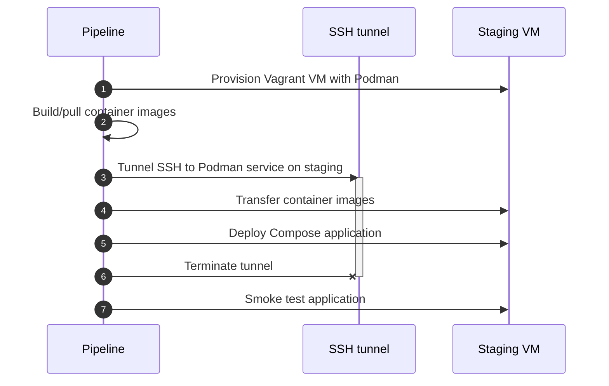

# Kerek: Lightweight continuous delivery for Docker Compose

Kerek is a CLI that adds features to Docker for people who like to keep
continuous delivery light and not deal with Kubernetes or a container registry.


## Key features

- Zero-downtime deployments for Docker Compose.
- Distributing images over SSH instead of a registry.
- Custom SSH config files supported for remote Docker instances.
- Compatible with Docker and Podman.

## Setup

### Prerequisites

- Docker or Podman
- Docker Compose

### Installing

```bash
cargo install --git https://github.com/evolutics/kerek
```

### Uninstalling

```bash
cargo uninstall kerek
```

## Usage

### Service update order

When updating services with `docker compose up`, the old container of a service
is stopped before a new container of the service is started, causing a service
interruption (**`stop-first`** case):

```
________________________
Old container           Stop
                                    ________________________
                                    Start      New container
```

Imagine we could make the container lifetimes overlap instead (**`start-first`**
case):

```
____________________________________
Old container                       Stop
                        ____________________________________
                        Start                  New container
```

Kerek supports both of these cases.

For services where a new container should be started before the old container is
stopped, configure this in your Compose file:

```diff
# compose.yaml
services:
  my-service:
    image: my-image
+   deploy:
+     update_config:
+       order: start-first
```

Now just run `kerek deploy` in place of `docker compose up`. No need to change
any other Docker Compose workflows.

Note that above config is an official (but optional) part of the
[Compose specification](https://github.com/compose-spec/compose-spec/blob/main/deploy.md).
However, vanilla Docker Compose always updates services in `stop-first` order,
even if your Compose file says otherwise.

### Zero-downtime deployments with a reverse proxy

To switch over traffic from old to new version of an application during an
update, it is common to use a reverse proxy.

See this [demo](examples/zero_downtime_deployment/compose.yaml) with an example
`greet` service, which is behind a `reverse-proxy` service (Caddy) for this
purpose:


As `greet` is configured in `start-first` update order, the `reverse-proxy` can
seamlessly switch over traffic from old to new container during their overlap.

Try it yourself:

```bash
cd examples/zero_downtime_deployment

kerek deploy --wait
curl localhost:8080 # … prints "Hi from A"

GREET_VERSION=B kerek deploy --wait
curl localhost:8080 # … prints "Hi from B"

docker compose down
```

To see above deployments in action, use a separate shell session to run

```bash
while true; do curl --fail --max-time 0.2 localhost:8080; sleep 0.01s; done
```

### Continuous delivery via SSH

There is an [example](examples/ssh_delivery/test.sh) of a pipeline that delivers
a Compose application to a staging environment. It does not need a container
registry but instead transfers images via SSH. Summary of the process:



### Support for Podman and other container engines

Pass `--container-engine podman` or set the environment variable
`CONTAINER_ENGINE=podman` to use Podman instead of Docker. Kerek is
engine-agnostic so you may use any other container engine with a compatible CLI.

Podman Compose is not supported as it currently lacks some needed features like
the calculation of service config hashes (`docker compose config --hash \*`).

### Docker CLI plugin

Kerek may be set up as a Docker CLI plugin. With that, calls to subcommands like
`kerek deploy` can be replaced by `docker deploy`, which some people prefer.
Example [setup](https://github.com/docker/cli/issues/1534):

```bash
mkdir --parents ~/.docker/cli-plugins
ln --symbolic ~/.cargo/bin/kerek ~/.docker/cli-plugins/docker-deploy
docker deploy --help
```

## Alternatives

Other lightweight options for continuous delivery of containerized applications:

- [Docker without Compose](https://github.com/evolutics/zero-downtime-deployments-with-podman)
- [`docker rollout`](https://github.com/Wowu/docker-rollout)
- [Docker Swarm mode](https://docs.docker.com/engine/swarm/)
- [K3s](https://docs.k3s.io)
- PaaS like [CapRover](https://caprover.com), [Dokku](https://dokku.com), etc.
- [`podman kube play`](https://docs.podman.io/en/latest/markdown/podman-kube-play.1.html)

## Command-line arguments reference

### `kerek --help`

```
Lightweight continuous delivery for Docker Compose

Usage: kerek [OPTIONS] <COMMAND>

Commands:
  deploy           Create or update services
  provision        Provisions host with container engine, making system-wide
                   changes
  transfer-images  Copies images from default to specified Docker host
  tunnel-ssh       Forwards local Unix domain socket to remote Docker host over
                   SSH
  help             Print this message or the help of the given subcommand(s)

Options:
      --container-engine <CONTAINER_ENGINE>
          Container engine program to use

          [env: CONTAINER_ENGINE=]
          [default: docker]

      --dry-run
          Do not apply changes, only show what would be done

      --config <CONFIG>
          Location of client config files

  -c, --context <CONTEXT>
          Name of the context to use to connect to the daemon (overrides
          DOCKER_HOST env var and default context set with `docker context use`)

  -D, --debug
          Enable debug mode

  -H, --host <HOST>
          Daemon socket to connect to

  -l, --log-level <LOG_LEVEL>
          Set the logging level

          [possible values: debug, info, warn, error, fatal]

      --tls
          Use TLS; implied by --tlsverify

      --tlscacert <TLSCACERT>
          Trust certs signed only by this CA

      --tlscert <TLSCERT>
          Path to TLS certificate file

      --tlskey <TLSKEY>
          Path to TLS key file

      --tlsverify
          Use TLS and verify the remote

  -h, --help
          Print help

  -V, --version
          Print version
```

### `kerek deploy --help`

```
Create or update services

Builds, (re)creates, and starts containers for a service.

If service names are given as command-line operands, this command does not
automatically start any of their linked services.

The containers are always run in the background (detached mode).

If there are existing containers for a service whose service config has changed
since the containers' creation, the changes are applied by recreating the
containers (preserving mounted volumes).

More precisely, a service is updated only if its service config hash changes
(details in https://github.com/docker/compose/blob/main/pkg/compose/hash.go).
Note that the service config hash does not depend on the container image
contents but only the `image` field. Thus, reusing an image tag like `latest`
does not trigger an update.

To force updating services regardless of config hash changes, use the
`--force-recreate` flag.

In summary:

| Command                           | Effect                                 |
| --------------------------------- | -------------------------------------- |
| `kerek deploy`                    | Update services with changed hash      |
| `kerek deploy x`                  | Update service `x` if its hash changed |
| `kerek deploy --force-recreate`   | Always update all services             |
| `kerek deploy --force-recreate x` | Always update service `x`              |
| `kerek deploy --dry-run`          | Only show what would be changed        |
| `docker compose config --hash \*` | Show service config hashes             |

Whether the old containers are stopped before or after the new containers are
started is controlled via `services.*.deploy.update_config.order` in a Compose
file. The options are `stop-first` and `start-first`, respectively.

Services are updated in lexicographical order (by Unicode code point),
regardless of dependencies. For each service, containers are stopped then
started (`stop-first`, default) or started then stopped (`start-first`),
respectively, and this is repeated for replicas:

- `stop-first` case:
  1. Stop old replica 1
  2. Start new replica 1
  3. Stop old replica 2
  4. Start new replica 2
  5. …
- `start-first` case:
  1. Start new replica 1
  2. Stop old replica 1
  3. Start new replica 2
  4. Stop old replica 2
  5. …

Usage: kerek deploy [OPTIONS] [SERVICE_NAMES]...

Arguments:
  [SERVICE_NAMES]...
          Services to consider

Options:
      --all-resources
          Include all resources, even those not used by services

      --ansi <ANSI>
          Control when to print ANSI control characters

          [possible values: never, always, auto]

      --compatibility
          Run compose in backward compatibility mode

      --env-file <ENV_FILE>
          Specify an alternate environment file

  -f, --file <FILE>
          Compose configuration files

      --parallel <PARALLEL>
          Control max parallelism, -1 for unlimited

      --profile <PROFILE>
          Specify a profile to enable

      --progress <PROGRESS>
          Set type of progress output

          [possible values: auto, tty, plain, json, quiet]

      --project-directory <PROJECT_DIRECTORY>
          Specify an alternate working directory (default: the path of the,
          first specified, Compose file)

  -p, --project-name <PROJECT_NAME>
          Project name

      --build
          Build images before starting containers

      --force-recreate
          Recreate containers even if their configuration and image haven't
          changed

      --no-build
          Don't build an image, even if it's policy

      --no-start
          Don't start the services after creating them

      --pull <PULL>
          Pull image before running

          [possible values: always, missing, never]

      --quiet-pull
          Pull without printing progress information

      --remove-orphans
          Remove containers for services not defined in the Compose file

  -V, --renew-anon-volumes
          Recreate anonymous volumes instead of retrieving data from the
          previous containers

  -t, --timeout <TIMEOUT>
          Use this timeout in seconds for container shutdown when containers are
          already running

      --wait
          Wait for services to be running|healthy

      --wait-timeout <WAIT_TIMEOUT>
          Maximum duration to wait for the project to be running|healthy

  -h, --help
          Print help (see a summary with '-h')
```

### `kerek provision --help`

```
Provisions host with container engine, making system-wide changes

This targets a host via SSH, unless host `localhost` and no SSH config file are
passed as arguments, in which case the current machine is targeted.

Usage: kerek provision [OPTIONS] <HOST>

Arguments:
  <HOST>
          Reference like `localhost` or `[ssh://][<user>@]<hostname>[:<port>]`

Options:
      --force
          Go ahead without prompting user to confirm

  -F, --ssh-config <SSH_CONFIG>
          Path to SSH config file

  -h, --help
          Print help (see a summary with '-h')
```

### `kerek transfer-images --help`

```
Copies images from default to specified Docker host

By default, only images absent on the destination host are transferred. An image
is considered present if the name matches one of these forms:

- `<namespace>:<tag>`
- `<namespace>@<digest>`
- `<namespace>:<tag>@<digest>`

Examples:

    kerek --host ssh://192.0.2.1 transfer-images my-img
    DOCKER_HOST=ssh://from kerek --host ssh://to transfer-images my-img
    DOCKER_CONTEXT=from kerek --context to transfer-images my-img
    docker compose config --images | kerek --host … transfer-images -

    kerek --host … transfer-images --compress zstd my-img
    kerek --host … transfer-images --compress 'xz -9' my-img

Usage: kerek transfer-images [OPTIONS] [IMAGES]...

Arguments:
  [IMAGES]...
          Images to copy; use `-` to pass image names as stdin lines

Options:
      --compress <COMPRESS>
          Compression command to use (`bzip2`, `gzip`, `xz`, `zstd`, etc.)

      --force
          Copy images without checking if the destination already has such
          images; useful for replacing images with `latest` tag

  -h, --help
          Print help (see a summary with '-h')
```

### `kerek tunnel-ssh --help`

```
Forwards local Unix domain socket to remote Docker host over SSH

This runs an SSH tunnel in the background. Meanwhile, you can connect to the
remote Docker host using `DOCKER_HOST=unix:///path/to/kerek.sock` locally. Note
that a custom SSH config file can be specified, unlike with vanilla Docker.

Example:

    kerek tunnel-ssh my-ssh-host
    CONTAINER_HOST="unix://${PWD}/kerek.sock" podman ps
    fuser --kill -TERM kerek.sock

Usage: kerek tunnel-ssh [OPTIONS] <SSH_HOST>

Arguments:
  <SSH_HOST>
          Reference like `[ssh://][<user>@]<hostname>[:<port>]`

Options:
      --local-socket <LOCAL_SOCKET>
          Path to Unix domain socket on localhost to be forwarded

          [default: kerek.sock]

      --remote-socket <REMOTE_SOCKET>
          Path to Unix domain socket of Docker host on remote

  -F, --ssh-config <SSH_CONFIG>
          Path to SSH config file

  -h, --help
          Print help (see a summary with '-h')
```
